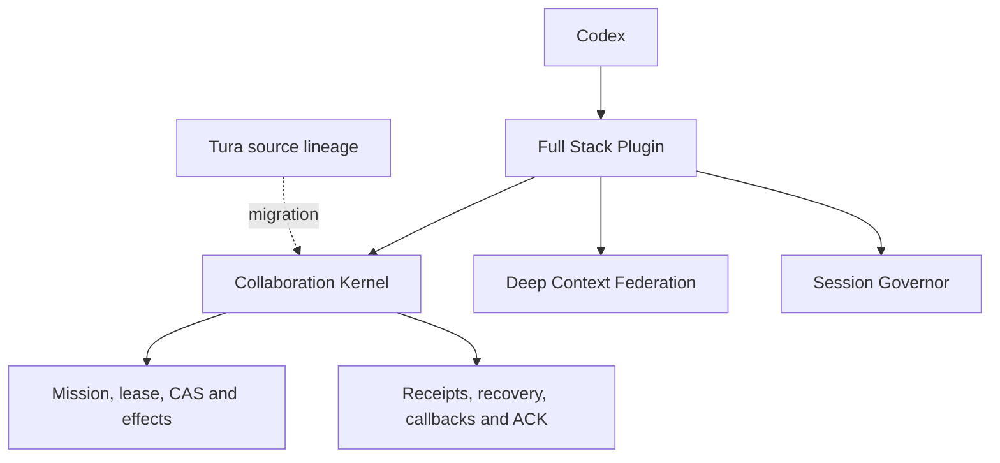

# Codex Full Stack Harness

Codex Full Stack Harness is the integration home for a local-first Codex
collaboration stack. It is evolving from a separate Tura runtime into a native
Codex plugin kernel backed by explicit context, execution, and continuity
contracts.

> **Status:** architecture and migration boundary published; the native plugin
> distribution is still under development. This repository does not yet claim
> a generally installable release.

## Architecture

The native Codex process is the runtime owner. The extracted collaboration
kernel supplies durable execution semantics without installing a second general
agent runtime beside Codex.

## Repository roles

| Repository | Responsibility |
| --- | --- |
| **codex-full-stack-harness** | Installable product boundary and native Codex integration. |
| [codex-collaboration-harness](https://github.com/nokiyliao/codex-collaboration-harness) | Public specifications, adapter contracts, examples, and benchmark evidence. |
| [deep-context-federation](https://github.com/nokiyliao/deep-context-federation) | Read-only context and evidence federation. |
| [codex-session-governor](https://github.com/nokiyliao/codex-session-governor) | Same-ID compaction and bounded session continuity. |
| [tura](https://github.com/nokiyliao/tura) | Historical AGPL source lineage for the extracted collaboration kernel. |

## Invariants

- Codex remains the single primary runtime and model-session owner.
- Context projection cannot silently increase execution authority.
- Effects bind to exact identities, leases, and CAS preconditions.
- Ambiguous effects are not retried blindly.
- Completion, callbacks, and Commander acknowledgement converge exactly once.
- Source, candidate, installed, running, and live-verified states remain distinct.

See [architecture](docs/architecture.md), [migration criteria](docs/migration.md),
and [source provenance](PROVENANCE.md).

## License

This integration repository is licensed under `AGPL-3.0-or-later` because the
planned kernel includes modified Tura-derived code. Component repositories retain
their own licenses. See [PROVENANCE.md](PROVENANCE.md).
