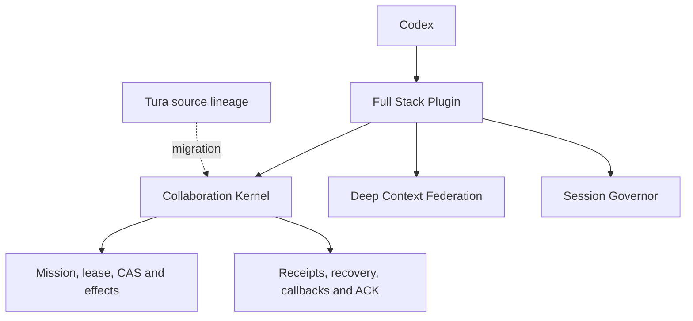

# Nokiy v9 - Codex Full Stack Harness

This repository now publishes the source of the local **Nokiy execution pipeline**.
The aggregate release `v9` combines caller v9 (`0.3.21.dev0`) with the previously
verified v8 Rust runtime artifacts. No binary is renamed or rebuilt just to align
version numbers. This is a **source snapshot**, not a portable binary release.

```text
Parent Codex task -> Nokiy prepare -> DCF/local context + J-Space
  -> direct/balanced Rust runtime -> tools -> terminal result -> parent acceptance
```

The default prepared `direct` profile uses execution-local Router and Session DB
processes; Codex retains the user's task, Goal and UI ownership. The separate
native-once path is not the default full runtime. The deterministic deploy lane
carries an already-authorized plan, not model-generated authority.

| Source | Purpose | License |
| --- | --- | --- |
| [packages/nokiy](packages/nokiy) | Python caller, context preparation, recovery, deployment, tests and skill | MIT |
| [runtime](runtime) | Modified Tura-derived Rust execution engine and build inputs | AGPL-3.0-or-later |
| [releases/v9.json](releases/v9.json) | Unified release identity, per-file source hashes and installed artifact identities | Repository license |

## Verify and build

```sh
python3 scripts/verify_release.py
python3 -m venv .venv
.venv/bin/python -m pip install ./packages/nokiy
.venv/bin/nokiy-embedded-run --help
cd runtime
cargo build --locked --release --bin tura_router --bin tura_runtime --bin tura_session_db --bin tura_exec
```

Python 3.11+ and the Rust toolchain pinned in `runtime/rust-toolchain.toml` are
required. Building is not live installation: execution also needs a machine-local
frozen runtime image, native Codex identity and a scoped prepared request.
See [v9 boundaries](docs/nokiy-v9.md). Do not copy credentials or reuse another
machine's absolute installation paths. DCF remains an external integration.

Source-to-binary reproducibility and clean-machine runtime installation have not
been established by this publication. Installed binary hashes are observations,
not proof that the source snapshot rebuilds byte-identically. No credentials,
session DBs, execution logs, build caches or installed binaries are published.

## Historical architecture proposal

The following section is retained as historical design intent. The v9 description
and manifest above supersede its distribution status and proposed plugin topology.

Codex Full Stack Harness is the integration home for a local-first Codex
collaboration stack. It is evolving from a separate Tura runtime into a native
Codex plugin kernel backed by explicit context, execution, and continuity
contracts.

> **Status:** architecture and migration boundary published; the native plugin
> distribution is still under development. This repository does not yet claim
> a generally installable release.

## Architecture



The native Codex process is the runtime owner. The extracted collaboration
kernel supplies durable execution semantics without installing a second general
agent runtime beside Codex.

## Repository roles

| Repository | Responsibility |
| --- | --- |
| **codex-full-stack-harness** | Installable product boundary and native Codex integration. |
| [codex-collaboration-harness](https://github.com/nokiyliao/codex-collaboration-harness) | Public specifications, adapter contracts, examples, and benchmark evidence. |
| [deep-context-federation](https://github.com/nokiyliao/deep-context-federation) | Read-only context and evidence federation. |
| [codex-session-governor](https://github.com/nokiyliao/codex-session-governor) | Same-ID compaction and bounded session continuity. |
| [tura](https://github.com/nokiyliao/tura) | Historical AGPL source lineage for the extracted collaboration kernel. |

## Invariants

- Codex remains the single primary runtime and model-session owner.
- Context projection cannot silently increase execution authority.
- Effects bind to exact identities, leases, and CAS preconditions.
- Ambiguous effects are not retried blindly.
- Completion, callbacks, and Commander acknowledgement converge exactly once.
- Source, candidate, installed, running, and live-verified states remain distinct.

See [architecture](docs/architecture.md), [migration criteria](docs/migration.md),
and [source provenance](PROVENANCE.md).

## License

This integration repository is licensed under `AGPL-3.0-or-later` because the
planned kernel includes modified Tura-derived code. Component repositories retain
their own licenses. See [PROVENANCE.md](PROVENANCE.md).
