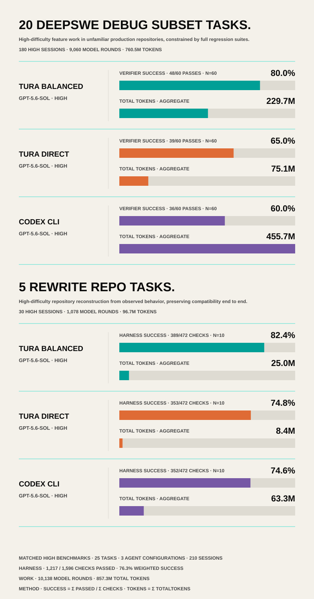

<p align="center">
  <a href="https://turaai.net/">
    
  </a>
</p>

<p align="center">
  <a href="https://turaai.net/"></a>
  <a href="https://turaai.net/benchmark"></a>
  <a href="https://www.npmjs.com/package/tura-ai"></a>
</p>

<p align="center"><strong>English</strong> | <a href="README.zh-CN.md">简体中文</a></p>

<h1 align="center">Tura: 16.7% better performance, 77.5% fewer tokens. </h1>

Tura is an open-source agent runtime harness that delivers better results with fewer tokens.

In a ReAct session, the model must re-enter after every tool result, repeatedly carrying the system prompt and a growing context. Tura turns the same task into one runtime-managed command graph, so deterministic execution continues without another model round trip.

<p align="center">
  
</p>

<p align="center"><em>Tura executes in one turn the same workflow that a ReAct architecture needs five turns to complete.</em></p>

Across 20 DeepSWE v1.1 tasks, each run three times per agent, Tura creates a substantial token-budget advantage by reducing repeated context and model round trips. You can spend that advantage in two ways. Direct turns most of it into lower cost: 77.5% fewer aggregate tokens than Codex CLI, with a comparable verifier success rate of 65.0% versus 63.3%. Balanced puts more of the saved budget back into reasoning, investigation, and verification. It reached an 80.0% success rate: 16.7 percentage points higher than Codex CLI: while still using 31.1% fewer tokens.[^debug-figure][^debug-manifests]

### Benchmark

Long-horizon task [benchmarks](https://turaai.net/benchmark) are one way to look past a polished isolated prompt and see how an agent handles real work. The published comparison uses harness-based development tasks with archived prompts, per-round tool calls, token usage, patches, and verifier results.

> The published artifacts compare the named Tura Balanced, Tura Direct, and Codex CLI configurations on 20 DeepSWE tasks, 5 rewrite tasks, and 2 separately reviewed design tasks. [^debug-figure]. [current test-set record](https://github.com/Tura-AI/benchmark/blob/main/doc/current-test-set-record.md). [^test-set-record]

The published results do not establish equivalent quality or performance for
every configured provider. Broader Anthropic/Claude, Google/Gemini,
OpenAI-compatible, local-provider, UI-latency, runtime/session parsing, and
cross-OS measurements remain part of the documented
[roadmap](ROADMAP.md) and [known evidence gaps](docs/KNOWN_ISSUES.md).

<details>
<summary><strong>FULL BENCHMARK REPORT</strong></summary>

<p align="center">
  
</p>

<p align="center"><em>Harness success and aggregate token usage across 25 high-difficulty tasks, 6 agent-and-model configurations, and 270 sessions. Source and calculation notes are linked below.</em></p>
</details>

### Screenshots

<p align="center">
  
</p>

<p align="center"><em>GUI page with multi-session concurrent work and HTML rich text support.</em></p>

<p align="center">
  
</p>

<p align="center"><em>TUI page with multi-session concurrent work and HTML rich text support.</em></p>

The results below come from published benchmark artifacts, not an uncited aggregate. Three systems do most of the work:

## Macro CLI Command Run

Most coding agents still depend on repetitive tool-calling loops: inspect, wait, patch, wait, build, wait, test, wait.

_**Tool-calling coding agent:**_

```bash
# Turn 1 :  inspect environment

rg -n "TODO|command_run|handler" crates/
rg --files crates/runtime/src crates/tools/src
```

```bash
# Turn 2 :  apply patch

*** Begin Patch
*** Update File: crates/tools/src/command_run/handler.rs
@@
-    // old command handler logic
+    // patched command handler logic
*** End Patch
```

```bash
# Turn 3 :  build

cargo build -p runtime
```

```bash
# Turn 4 :  run tests

cargo test -p runtime --lib
```

```bash
# Turn 5 :  run lint validation

cargo clippy -p runtime --all-targets
```

Tura takes a different route. Instead of exposing dozens of small tools to the model, it exposes one macro tool: `command_run`. The agent can then build a multi-step execution tree and run related actions in one LLM turn.

In the example below, both agents run the same commands. A normal tool-calling agent needs five LLM turns; Tura handles the sequence as one structured macro workflow. The saved work is conversational overhead, not engineering discipline.

_**Tura macro CLI command:**_

```json
{
  "name": "command_run",
  "arguments": {
    "commands": [
      {
        "step": 1,
        "command_type": "shell_command",
        "command_line": "rg -n \"TODO|command_run|handler\" crates/"
      },
      {
        "step": 1,
        "command_type": "shell_command",
        "command_line": "rg --files crates/runtime/src crates/tools/src"
      },
      {
        "step": 2,
        "command_type": "apply_patch",
        "command_line": "*** Begin Patch\n*** Update File: crates/tools/src/command_run/handler.rs\n@@\n-    // old command handler logic\n+    // patched command handler logic\n*** End Patch"
      },
      {
        "step": 3,
        "command_type": "shell_command",
        "command_line": "cargo build -p runtime"
      },
      {
        "step": 4,
        "command_type": "shell_command",
        "command_line": "cargo test -p runtime --lib"
      },
      {
        "step": 4,
        "command_type": "shell_command",
        "command_line": "cargo clippy -p runtime --all-targets"
      }
    ]
  }
}
```

There is no ablation test proving that `command_run` alone causes Tura's lower turn and token usage. Across the full DeepSWE comparison, however, Balanced used 35.8% fewer turns and 31.1% fewer tokens than Codex CLI, while Direct used 69.1% fewer turns and 77.5% fewer tokens.[^debug-figure][^debug-manifests]

## Backward Reasoning

However impressive LLMs can be, an LLM is still, at its core, a statistical induction model over text-token probabilities.

For example, asking an LLM to choose among rock, paper, and scissors does not guarantee a uniform random result. If a true one-in-three distribution matters, the choice needs an external random-number source rather than an uncited assumption about model output probabilities.

In coding tasks, this is often fatal.

An agent is more likely to execute and generate code and logic that are statistically more common. But common code and common logic are often mediocre and under-considered.

Tura uses a different strategy.

During reasoning, a common agent reasons from the current state to the prompt goal. In that case, $s_1$ is the current state, and $s_n$ is the goal given by the user prompt.

$$
s_1 \rightarrow s_2 \rightarrow s_3 \rightarrow \cdots \rightarrow s_n
$$

Instead, Tura guides the LLM to statistically estimate $s_{n-1}$ first, then reason backward from the state of $s_{n-1}$ to $s_{n-2}$.

In the example below, the LLM can derive the optimal strategy for playing rock-paper-scissors correctly.

```
> To keep rock-paper-scissors fair and challenging,
> We need unbiased play.
> Each move must have a true one-in-three chance.
> An LLM cannot guarantee that from text probabilities alone.
> Use a random-number generator script to generate randint(1, 3)
> Then map rock, paper, or scissors to the number.
```

In programming tasks, this means that when an agent sees a goal like fixing a frontend bug, it is guided to reason through the full execution path, reconstruct the failure state, and identify the root cause before writing code. In the published DeepSWE comparison, Tura Balanced passed 10 more of 60 binary task verifiers than Codex CLI.

On the same 20-task subset, DeepSWE’s official mini-swe-agent results show an 8% gap between GPT-5.6 SOL High and Medium reasoning, while Tura Balanced leads Codex CLI by 16.7%. This indicates that higher reasoning effort alone does not explain Tura’s advantage.[^debug-manifests][^rewrite-manifest]

## Runtime Context and Prompt Manager

Skills are often just weaker prompts loaded into context.

In many agent frameworks, a long-lived session keeps accumulating skill files, tool outputs, and stale task history. When the context becomes too large, the agent enters a separate compaction turn, but that compaction usually preserves only a compressed summary. Important execution details can become vague or lost.

Tura treats context as part of the runtime state machine.

Instead of relying on users to manually reset sessions or letting Markdown skills pile up, Tura uses `task_status`, runtime prompts, and recursive execution manuals to keep the active context scoped to the current task.

Traditional skill-based agents usually keep one session running until the user starts another, load broad Markdown skills into that session, and leave them active until a reset or compaction. Tura instead ties runtime prompts to explicit task state: sessions can be renamed, refreshed, and managed automatically; task-specific manuals and CLI commands are loaded through a recursive task tree; and irrelevant context can be removed, replaced, or compacted from the CLI. The checkpoint can retain code locations, patches, tests, and task status rather than only a loose summary. In practice, that means less stale context, lower task-scoped token cost, and fewer chances for an old skill or vague summary to steer the current job.

Because compaction is a CLI operation, Tura can preserve exact execution state in `task_status.compact_context`. In the published benchmark sessions, Tura moved beyond read-only inspection and resumed execution an average of 2.6 rounds after compaction, compared with an estimated 5.4 rounds for Codex.[^compact-dynamodb][^compact-wasmi-r1][^compact-wasmi-r2][^compact-wasmi-r3][^compact-eza]

Tura's 2.6-round result is calculated from explicit `compact_context` events in its archived round contracts. Codex does not expose equivalent compaction events, so its 5.4-round result is estimated from points where input-token usage drops sharply, excluding identifiable media-reading boundaries.

## Install and run

### NPM release

Global install (macOS, Linux, and Windows):

```bash
npm install -g tura-ai
tura
```

Local project install:

```bash
npm install tura-ai
npx --no-install tura
```

The npm package does not run a `postinstall` lifecycle script. The `tura`
wrapper resolves and launches the installed platform package directly.

The same main package is also published to GitHub Packages as `@tura-ai/tura`.
Configure the `@tura-ai` scope for `https://npm.pkg.github.com`, authenticate
with a token that has `read:packages`, then install `@tura-ai/tura`. The
unscoped `tura-ai` package on npm remains the simplest public installation.

Tura does not bundle provider credentials. On first launch, configure an LLM
provider and select one of its models before sending a prompt. See
[Provider setup](docs/start/providers.md#first-run-configure-an-llm-provider) for
the CLI, TUI, and GUI flows.

### Source checkout

Windows PowerShell:

```powershell
git clone https://github.com/Tura-AI/tura.git
cd tura
.\scripts\install.ps1
tura
```

macOS or Linux shell:

```bash
git clone https://github.com/Tura-AI/tura.git
cd tura
./scripts/install.sh
tura
```

The source installer performs the complete environment setup, release build,
and user PATH registration flow. Pass `-EnvironmentOnly` on PowerShell or
`--environment-only` on macOS/Linux only when you intentionally want dependency
setup without building or registering Tura.

### Common entrypoints

| Entry                                | Use it for                                           |
| ------------------------------------ | ---------------------------------------------------- |
| `tura`                               | Interactive terminal UI.                             |
| `tura "prompt"`                      | Open the TUI with an initial prompt.                 |
| `tura exec "prompt"`                 | Direct Rust CLI prompt runner.                       |
| `tura run "prompt"`                  | Gateway-backed prompt with streaming/history.        |
| `tura bash`, `tura zsh`, `tura shel` | Prompt with a selected command-run shell surface.    |
| `tura_gateway`                       | Local HTTP/SSE gateway and optional web GUI serving. |
| `tura_gui`                           | Desktop GUI workspace client.                        |

For OS-specific PATH requirements, executor installation, and how to register the
CLI when the executable is not on PATH, read
[How to start](docs/start/how-to-start.md). For command flags and modes, read
[CLI parameters](docs/start/cli-parameters.md).

## Documentation

The GitBook-style documentation index is [docs/SUMMARY.md](docs/SUMMARY.md). The
full navigation page is [docs/start/navigation.md](docs/start/navigation.md).

### Start

- [Overview](docs/start/overview.md)
- [Install](docs/start/install.md)
- [How to start](docs/start/how-to-start.md)
- [CLI parameters](docs/start/cli-parameters.md)
- [Settings](docs/start/settings.md)
- [Providers](docs/start/providers.md)
- [Sessions](docs/start/sessions.md)
- [Navigation](docs/start/navigation.md)

### Core

- [Task status](docs/core/task-status.md)
- [Context management](docs/core/context-management.md)
- [Runtime prompt](docs/core/runtime-prompt.md)
- [Command run](docs/core/command-run.md)
- [Commands](docs/core/commands.md)
- [Agents](docs/core/agents.md)
- [Personas](docs/core/personas.md)
- [Rich text](docs/core/html-rich-text.md)
- [Dynamic prompt injection](docs/core/prompt-style.md)

### Architecture

- [System architecture](ARCHITECTURE.md)
- [Runtime / Session equivalence gate](tests/equivalence/runtime_session/README.md)
- [Session DB](crates/session_log/ARCHITECTURE.md)
- [Gateway](crates/gateway/ARCHITECTURE.md)
- [Router](crates/router/ARCHITECTURE.md)
- [Runtime](crates/runtime/ARCHITECTURE.md)
- [Tool](crates/tools/ARCHITECTURE.md)
- [Terminal user interface](apps/tui/ARCHITECTURE.md)
- [Graphic user interface](apps/gui/ARCHITECTURE.md)

### Customization

- [Custom providers](docs/customization/custom-providers.md)
- [Custom personas](docs/customization/custom-personas.md)
- [Custom agents](docs/customization/custom-agents.md)
- [Custom runtime prompt](docs/customization/custom-runtime-prompt.md)
- [Custom commands](docs/customization/custom-commands.md)

### Development

- [Scripts](scripts/ARCHITECTURE.md)
- [Testing](scripts/ARCHITECTURE.md#xtask-test-collection-scripts)
- [Environment](docs/start/settings.md)
- [Architecture](ARCHITECTURE.md)
- [Benchmark methodology](https://github.com/Tura-AI/benchmark/blob/main/doc/benchmark-methodology.md)
- [Current test-set evidence record](https://github.com/Tura-AI/benchmark/blob/main/doc/current-test-set-record.md)
- [Benchmark artifacts](https://github.com/Tura-AI/benchmark/tree/main/results)

## Contributing and project governance

Contributions should be small, reviewable, and supported by evidence at the
test layer that owns the affected behavior. Choose the matching issue and pull
request type rather than applying one checklist to every change.

- [Contributing](.github/CONTRIBUTING.md) - start here for contribution types,
  development setup, test selection, and pull-request steps.
- [Contribution guide](docs/contributing-guide.md) - test ownership, affected
  matrices, performance evidence, and artifact-sanitization rules.
- [Roadmap](ROADMAP.md) - current 0.1.x stabilization priorities and the planned
  0.2 task-planning workspace.
- [Known issues and evidence gaps](docs/KNOWN_ISSUES.md) - open architecture,
  provider, benchmark, performance, and cross-OS work.
- [Code of Conduct](.github/CODE_OF_CONDUCT.md) - community standards and the
  open agent-harness principle.
- [Security policy](.github/SECURITY.md) - supported versions and private
  vulnerability reporting.
- [Support](.github/SUPPORT.md) - where to report bugs, request features, or ask
  setup and usage questions.

## License

Tura is licensed under AGPL-3.0-or-later. See [LICENSE](LICENSE).

## Benchmark notes and sources

- [Benchmark methodology](https://github.com/Tura-AI/benchmark/blob/main/doc/benchmark-methodology.md)
- [Current test-set evidence record](https://github.com/Tura-AI/benchmark/blob/main/doc/current-test-set-record.md)
- [Benchmark artifacts](https://github.com/Tura-AI/benchmark/tree/main/results)

[^debug-figure]: [DeepSWE and Rewrite Repo comparison figure](assets/data/benchmark-agent-comparison.svg). The figure states the task, session, verifier, turn, token, and aggregation scopes used by the README.

[^test-set-record]: [`tura-benchmark` current test-set record](https://github.com/Tura-AI/benchmark/blob/main/doc/current-test-set-record.md), including direct links to all eight published design HTML artifacts and their run contracts.

[^debug-manifests]: [`tura-benchmark` DeepSWE replicate 1](https://github.com/Tura-AI/benchmark/blob/main/results/debug/report-deepswe-v1.1-gpt56-sol-local-r01/manifest.json), [replicate 2](https://github.com/Tura-AI/benchmark/blob/main/results/debug/report-deepswe-v1.1-gpt56-sol-local-r02/manifest.json), and [replicate 3](https://github.com/Tura-AI/benchmark/blob/main/results/debug/report-deepswe-v1.1-gpt56-sol-local-r03/manifest.json). Each manifest contains 20 tasks across the same three agent configurations; together they contain 180 sessions.

[^rewrite-manifest]: [`tura-benchmark` GPT-5.6 Rewrite Repo canonical manifest](https://github.com/Tura-AI/benchmark/blob/main/results/rewrite/report-20260710-gpt56-sol/canonical-manifest.json). The cited totals are Tura Balanced 389/472 and Codex CLI 351/472 across 10 sessions each.

[^compact-dynamodb]: [`tura-benchmark` DynamoDB round 107 compact](https://github.com/Tura-AI/benchmark/blob/main/results/debug/report-deepswe-v1.1-gpt56-sol-local-r01/dynamodb-toolbox-conditional-attribute-requirements/tura-balanced/dynamodb-toolbox-conditional-attribute-requirements-tura-balanced-run-01/metadata/contracts/rounds/round-0107.json) and [round 114 first later patch](https://github.com/Tura-AI/benchmark/blob/main/results/debug/report-deepswe-v1.1-gpt56-sol-local-r01/dynamodb-toolbox-conditional-attribute-requirements/tura-balanced/dynamodb-toolbox-conditional-attribute-requirements-tura-balanced-run-01/metadata/contracts/rounds/round-0114.json).

[^compact-wasmi-r1]: [`tura-benchmark` Wasmi replicate 1 round 43 compact](https://github.com/Tura-AI/benchmark/blob/main/results/debug/report-deepswe-v1.1-gpt56-sol-local-r01/wasmi-trap-coredumps/tura-balanced/wasmi-trap-coredumps-tura-balanced-run-01/metadata/contracts/rounds/round-0043.json) and [round 44 first non-read action](https://github.com/Tura-AI/benchmark/blob/main/results/debug/report-deepswe-v1.1-gpt56-sol-local-r01/wasmi-trap-coredumps/tura-balanced/wasmi-trap-coredumps-tura-balanced-run-01/metadata/contracts/rounds/round-0044.json). The run ends at round 46 without a later patch or test action.

[^compact-wasmi-r2]: [`tura-benchmark` Wasmi replicate 2 round 26 compact](https://github.com/Tura-AI/benchmark/blob/main/results/debug/report-deepswe-v1.1-gpt56-sol-local-r02/wasmi-trap-coredumps/tura-balanced/wasmi-trap-coredumps-tura-balanced-run-02/metadata/contracts/rounds/round-0026.json), [round 28 first non-read action](https://github.com/Tura-AI/benchmark/blob/main/results/debug/report-deepswe-v1.1-gpt56-sol-local-r02/wasmi-trap-coredumps/tura-balanced/wasmi-trap-coredumps-tura-balanced-run-02/metadata/contracts/rounds/round-0028.json), and [round 39 first later patch/test](https://github.com/Tura-AI/benchmark/blob/main/results/debug/report-deepswe-v1.1-gpt56-sol-local-r02/wasmi-trap-coredumps/tura-balanced/wasmi-trap-coredumps-tura-balanced-run-02/metadata/contracts/rounds/round-0039.json).

[^compact-wasmi-r3]: [`tura-benchmark` Wasmi replicate 3 round 39 compact](https://github.com/Tura-AI/benchmark/blob/main/results/debug/report-deepswe-v1.1-gpt56-sol-local-r03/wasmi-trap-coredumps/tura-balanced/wasmi-trap-coredumps-tura-balanced-run-03/metadata/contracts/rounds/round-0039.json) and [round 41 first later patch/test](https://github.com/Tura-AI/benchmark/blob/main/results/debug/report-deepswe-v1.1-gpt56-sol-local-r03/wasmi-trap-coredumps/tura-balanced/wasmi-trap-coredumps-tura-balanced-run-03/metadata/contracts/rounds/round-0041.json).

[^compact-eza]: [`tura-benchmark` eza round 23 compact](https://github.com/Tura-AI/benchmark/blob/main/results/rewrite/report-20260710-gpt56-sol/eza/tura-balanced/eza-tura-balanced-gpt56-sol-run-02/metadata/contracts/rounds/round-0023.json) and [round 24 first later test](https://github.com/Tura-AI/benchmark/blob/main/results/rewrite/report-20260710-gpt56-sol/eza/tura-balanced/eza-tura-balanced-gpt56-sol-run-02/metadata/contracts/rounds/round-0024.json).
